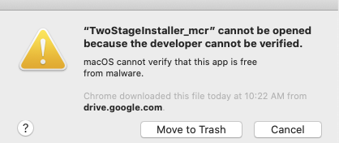

# twostagetask
modified two-stage markov decision task from Daw et al., 2011 & Gillan et al., 2015

# Instructions for set-up:

## Testing your internet speed
1. Go to [google.com](https://google.com) and type in "internet speed test"

2. Below the search bar, click on the blue button that says "Run Speed Test" and wait.

3. If you have a minimum of 25 Mbps download speed and 3 Mbps upload speed, continue to the next section below [(Run with remote desktop)](#run-with-remote-desktop). Otherwise, go to [task installation instructions (supported for Macs only)](#task-installation-instructions). 

 

---

## Run with remote desktop
1. If you do not already have the Google Chrome web browser installed, please follow [instructions here to install Google Chrome](https://support.google.com/chrome/answer/95346?co=GENIE.Platform%3DDesktop&hl=en)

2. On your Google Chrome browser, go to: [https://remotedesktop.google.com/access](https://remotedesktop.google.com/access)

 &nbsp;&nbsp;&nbsp;&nbsp;&nbsp;&nbsp; **If you do not have a google account:**  
 &nbsp;&nbsp;&nbsp;&nbsp;&nbsp;&nbsp; the webpage will prompt you to sign in.

&nbsp;&nbsp;&nbsp;&nbsp;&nbsp;&nbsp;  Use the following information:

&nbsp;&nbsp;&nbsp;&nbsp;&nbsp;&nbsp;  **Email:** npnl.remote  
&nbsp;&nbsp;&nbsp;&nbsp;&nbsp;&nbsp;  **Password:** this will be a one-time use password sent to you by the experimenter

&nbsp;&nbsp;&nbsp;&nbsp;&nbsp;&nbsp;  **If you DO have a google account:**  
 &nbsp;&nbsp;&nbsp;&nbsp;&nbsp;&nbsp; you will still need to sign in with the above credentials.  
 &nbsp;&nbsp;&nbsp;&nbsp;&nbsp;&nbsp; You can do so by clicking the circle icon in the top right corner of the webpage. 

3. After you have successfully logged in, you should see a white box labeled "NPNL Desktop", like this:

  Click on the white box that says "NPNL Desktop", and enter the unique **PIN** given to you by the experimenter. 

  That's it! You should be able to see the experimenter’s screen.

 

---

## Task Installation Instructions 
NOTE: this is only for Mac operating systems. Windows and Linux OS operating systems are currently not supported.

#### Downloading Application From Google Drive

First, you are going to download the file you need to install the application. This file is called __TwoStageInstaller_mcr__.

1. The experimenter will send you an email with a Link to download task. 

    Clicking on the link should take you to a page that looks like this on Google Drive:
    
    

2. Click on **DOWNLOAD ALL** and you should see a pop-up appear that says "Preparing download". It may take some time to zip the files, depending on your internet connection speed.

3. After it is done zipping, you may see a pop-up window, depending on your browser. Click on YES, and your download will begin. This may also take some time.

#### Installing the Application
1. Now that the file has downloaded, double click on the TwoStageInstaller_mcr.zip file to first unzip the file, then double click on the resulting icon (TwoStageInstaller_mcr).  

2. When you see a pop-up that says "TwoStageInstaller_mcr cannot be opened becase the developer cannot be verified", click on "Cancel".

3. Next, go to __Security & Privacy__ in __System Preferences__ by typing in "Security & Privacy" in the spotlight search icon, or going to __Apple Menu > System Preferences > Security & Preferences__.

4. You should see this screen below. Where it says "TwoStageInstaller_mcr" was blocked from use because it is not from an identified developer, click on "Open Anyway". 

5. You may see another warning that the developer is unverified. Click on "Open" again. 

6. When you see a __Java__ pop-up saying "java wants to make changes". Go ahead and enter in your computer user name and password.

7. Now, you will see the installer that looks like this. Follow the steps of the installer, which will install MATLAB Runtime and the Two Stage Task. 

8. When you have successfully installed the applications, your installer window should look like this. 

#### Quieting key entry
This part may not be necessary depending on the Mac OS version you are using. This step eliminates the annoying error sound each time you press a key while the application is running.

1. Go to your spotlight search icon (the magnifying glass on the top right of your computer), and type in "sound". You can also access this by going to __Apple Menu > System Preferences > Sound__.

2. Now, you should see a window like the one below. Find "Funk" and bring the Alert volume all the way down, and uncheck the two boxes below. 

    
   Great! Now we are ready to start the program!

#### Running the program
1. To run the program, go to your __Applications__ directory by going to __Finder > Go > Applications__. 
    Within __Applications__, find a folder called __TwoStage_DecisionTask__, then go to "application", and click on the icon that says "TwoStage_DecisionTask". This should open up the program.

2. If it starts, and then stops running, you may need to go back to __Security & Preferences__ and click on "Open Anyway" to allow the installed application to run. This should only happen the first time you run it.

3. When the application opens, you will see a pop-up window that says "Select a destination to save your files. We recommend saving files to your desktop". 

4. Voila! You have successfully started the program! Continue following the prompts it gives you. You will first go through the instructions, which are broken down into 3 parts, and then be given a short quiz to make sure you are understanding the instructions correctly. After you pass the quiz, the real experiment begins!

