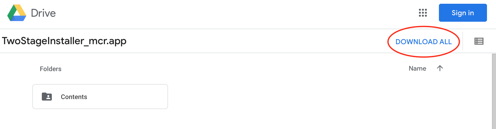

# Two-Stage Task 

Welcome to our github page! 

Please see installation instructions to participate in the two-stage decision task below.

## Installation Instructions

[Mac](#mac-installation-instructions)

[Windows](#windows-installation-instructions)

### Mac Installation Instructions

__Downloading From Google Drive__
 
First, you are going to download the file you need to install the application. This file is called __TwoStageInstaller_mcr__.

1. In the email that linked you to this page, click on "Link to download task".

    This should take you to a page that looks like this on Google Drive:
    
    

2. Click on **DOWNLOAD ALL** and you should see a pop-up appear that says "Preparing download". It may take some time to zip the files, depending on your internet connection speed.

3. After it is done zipping, you may see a pop-up window, depending on your browser. Click on YES, and your download will begin. This may also take some time.

__Installing the Application___
1. Now that the file has downloaded, double click on the TwoStageInstaller_mcr file.  

2. You will encounter another pop up 

### Windows Installation Instructions

## Acknoweldgements
This modified two-stage markov decision task is adapted from Daw et al., 2011 &amp; Gillan et al., 2015

